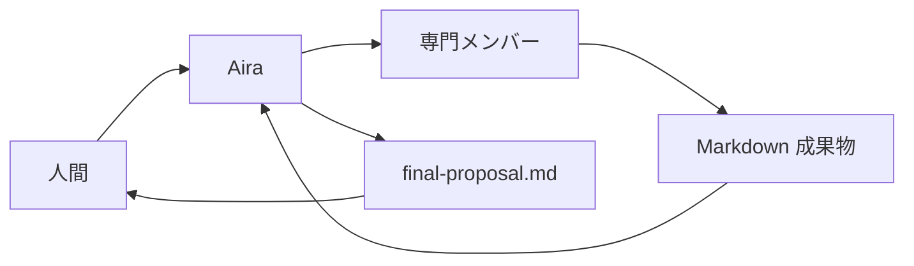

# agent-team

agent-team は、複数の専門観点を持つ AI エージェントが Markdown
成果物を介して議論し、人間が採用 / 却下 / 保留できる提案を作る
ためのチームである。AI は意思決定しない。判断材料を作る。

このリポジトリが正本である。他のリポジトリへ導入するときは、
ここからインストーラを実行する。チームの定義と使い方の入口は
[docs/agent/guide.md](docs/agent/guide.md) である。

> **Note:** このリポジトリは、チームを育てる実験場でもある。
> 下流へ配るのはチーム定義と起動口であり、デモアプリや作業履歴
> ではない。

## これは何か

人間が Aira（アイラ）に依頼する。Aira が観点を分け、加入済み
メンバーへ振る。各担当は指定された `docs/work/` 成果物だけを
書く。Aira が `final-proposal.md` へ統合し、人間が判断する。

エージェント間のやり取りは直接会話ではなく、Markdown 成果物で
行う。人間の明示承認なしに、最終決定、正本 docs の変更、merge、
deploy、破壊的操作は行わない。



## メンバー

役割の詳細は [docs/agent/team.md](docs/agent/team.md) を読む。

| 名前 | 役割 |
| --- | --- |
| Aira（アイラ） | 進行・統合。メイン会話そのもの。サブエージェントにしない |
| Rin（凛） | リスク番人。反対意見と P0 / P1 / P2 |
| Shino（篠） | 要件整理 |
| Kai（甲斐） | アーキテクチャ。複数案と比較 |
| Toki（時） | QA・テスト分析 |
| Ritsu（律） | 実装・複合実行 |
| Hayate（疾風） | 短時間制約付きの限定実装 |

## インストール

導入先のリポジトリで、このリポジトリから直接実行する。
ローカルに agent-team を置いておく必要はない。

### 前提条件

インストーラは [Deno](https://deno.land/) で動く。アーカイブの
展開に `tar` を使う。リモートから入れるときは、ネットワーク接続
が必要である。

Deno が未導入なら、先に入れる。

```bash
curl -fsSL https://deno.land/install.sh | sh
```

### 他のリポジトリへ導入する

導入先リポジトリのルートで、次を実行する。取得元は
`https://github.com/shun/agent-team` に固定する。

```bash
deno run --allow-read --allow-write --allow-net --allow-run \
  https://raw.githubusercontent.com/shun/agent-team/main/scripts/install-agent-team.ts \
  --target .
```

インストーラは宣言したファイルだけをコピーする。ルートの
`AGENTS.md` や `CLAUDE.md` は書かない。

### 版を指定する

既定の参照は `main` である。ブランチ、タグ、コミットを選ぶときは
`--ref` を付ける。

```bash
deno run --allow-read --allow-write --allow-net --allow-run \
  https://raw.githubusercontent.com/shun/agent-team/main/scripts/install-agent-team.ts \
  --target . \
  --ref v1.0.0
```

### 更新する

更新も同じコマンドである。前回インストールした内容と一致する
ファイルだけを上書きする。導入先で内容が変わっているファイルは
上書きせず、`skip <path>` と報告する。

### 導入先で読み込みを追加する

インストーラは、ルートのコンテキストファイルを書かない。
導入先で使っているツールの入口へ、次を追記する。

```text
MUST READ docs/agent/guide.md
```

追記先の例は次のとおり。

- Cursor / Codex: `AGENTS.md`
- Claude Code: `CLAUDE.md`
- Antigravity: そのリポジトリが使う入口ファイル

追記したファイルは、そのリポジトリ固有の事情だけを持てばよい。
チームの定義は置かない。

### このリポジトリのクローンから入れる

このリポジトリをローカルにクローン済みなら、クローンを
`--source` に渡して導入できる。

```bash
git clone https://github.com/shun/agent-team.git
deno run --allow-read --allow-write --allow-net --allow-run \
  ./agent-team/scripts/install-agent-team.ts \
  --source ./agent-team \
  --target /path/to/your-repo
```

### インストーラが置くもの

置くものと置かないものは、
[scripts/install-manifest.json](scripts/install-manifest.json)
が正である。

| 置く | 置かない |
| --- | --- |
| `docs/agent/`（`guide.md` を含む正本） | `docs/work/`（作業成果物） |
| `docs/roadmap.md` | `docs/notes/`（凍結コピー） |
| `docs/decisions/`（ADR） | `.ai/board/`、`tmp/` |
| `.codex/`、`.agents/`、`.claude/agents/` | `mission-room/`（デモ） |
| `scripts/run-plan.ts` | ルートの `AGENTS.md`、`CLAUDE.md` |

適用結果は `docs/agent/.install-lock.json` に記録する。

## 使い方

導入後は、人間が Aira に依頼する。計画が必要なときは
「〜を計画して」と依頼する。実装は、人間が別途承認したあとだけ
進める。既定の実装担当は Ritsu である。

手順の正本は [docs/agent/workflow.md](docs/agent/workflow.md)
である。

## 安全境界

禁止事項の正本は [docs/agent/safety.md](docs/agent/safety.md)
である。迷った操作は実行せず、人間に確認する。

下流で直した内容を上流へ戻すときは、このリポジトリへの
Pull Request にする。下流を独自の正本にはしない。

## 次の一歩

導入が終わったら、次を読む。

1. [docs/agent/guide.md](docs/agent/guide.md) — 共通入口
2. [docs/agent/team.md](docs/agent/team.md) — 役割と成果物
3. [docs/agent/safety.md](docs/agent/safety.md) — 禁止事項
4. [docs/agent/workflow.md](docs/agent/workflow.md) — 進め方
