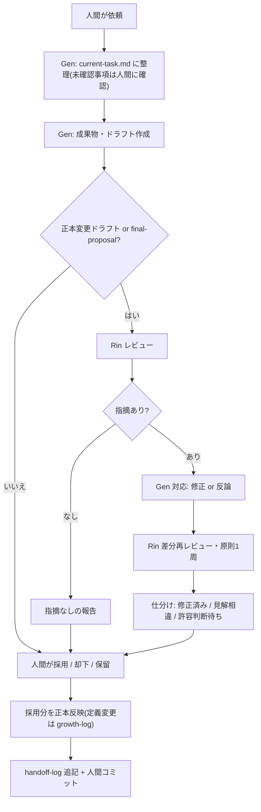

# Agent Team ワークフロー(workflow)

> **状態: 確定(2026-07-05 人間承認)**
> 作成: 2026-07-05 / 起案: Gen(玄)
> 対象範囲: **人間 ⇄ Gen だけの最小フロー**(チームが Gen 一人の間)。メンバーが5人そろったら [original-memo.md](../notes/original-memo.md) セクション16 の標準フローに更新する(roadmap Stage 4)。
> 元ネタ: Stage 1 での人間の判断(Q1 / Q3 / 進捗一本化 / ADR ルール)+ [safety.md](safety.md)(確定済み)

このファイルは、人間と Gen が仕事を進めるときの手順の正本である。禁止事項の正本は [safety.md](safety.md) であり、本ファイルと矛盾した場合はより厳しい方を適用する。

---

## 1. 基本フロー

1. 人間が依頼・テーマを出す(チームへの入口は Gen)
2. Gen が `docs/work/current-task.md` に目的・範囲・完了条件・確認事項を整理する
3. 未確認事項があれば人間に確認する(未確認のまま決定として進めない)
4. Gen が成果物を `docs/work/` 配下に作る。正本 docs の変更が必要ならドラフトを提示する
5. **正本 docs の変更ドラフトと final-proposal は、人間の判断の前に Rin のレビューを経る**(必須はこの2種のみ。それ以外は人間または Gen が必要と判断したとき。2026-07-05 判断C)
   - Rin が指摘を出したら、Gen が対応(修正または反論)し、修正分は Rin が差分を再レビューする(原則1周まで。収束しなければ争点のまま人間へ)
   - 人間に上げる際、指摘を「修正済み / 見解相違(両論併記)/ 人間の許容判断待ち」に仕分けて添える。**Rin の OK は人間に上げる前提条件ではない**(Rin は拒否権を持たない。争点を裁くのは人間。反対は解消してから出すのではなく、見えるまま出す)
6. 人間が採用 / 却下 / 保留を判断する。**Rin の P0 / P1 指摘は、明示的な判断結果が該当成果物(risk-review.md 等)の該当項目に記録されるまで、当該対象の確定・Stage の完了をしない**(却下は正常な結果。判断の記録のみを義務とする。2026-07-05 判断D)
7. 採用分だけ正本 docs に反映する。定義変更は growth-log に記録する
8. セッションの区切りで handoff-log に作業記録を追記する。**人間はこのタイミングでコミットする**(未コミット差分の窓を短く保つ。2026-07-05 Rin 指摘 P1-4)

以下は基本フローの補助図(**上の番号付きリストが正**。図と食い違う場合はリストに従い、リスト変更時は図も直す):

(図は補助のため意図的に簡略化している: 未確認事項の確認ループは B に畳み込み / 6 の P0・P1 明示判断ルールは H のラベルに含めず / 必須2種以外の任意 Rin レビュー経路は D では省略 / G の条件「観点一覧の添付」は team.md 判断E を参照。経緯は growth-log(2026-07-05)— 人間承認、Rin レビュー2周済み。詳細履歴は jj 履歴)

## 2. ファイルの扱い(書き込み権限)

| 場所 | エージェント単独での書き込み(全メンバー共通) | 備考 |
|---|---|---|
| `docs/work/` 配下 | **可**(作成・更新。Q1 で確定、2026-07-05 全エージェントに一般化) | 削除・移動は人間に提案してから |
| `.ai/board/` 配下 | **可**(追記) | handoff-log / growth-log |
| 正本 docs(`AGENTS.md`・`CLAUDE.md`・`docs/agent/`・`docs/roadmap.md`・`docs/decisions/`・`.claude/` 配下全体) | **不可** | ドラフト提示まで。反映は人間承認後(3・6節) |
| `docs/notes/original-memo.md` | **不可** | 凍結コピー。参照のみ |
| `tmp/` 配下 | **不可** | 参照も引用もしない(凍結コピーを参照する) |

バージョン管理(jj / git)の操作は常に人間が行う。**Gen を含むすべてのエージェント(今後迎えるメンバー・サブエージェントも同様)は原則一切実行しない**(Q2)。**唯一の例外**: 閲覧目的の `jj st` / `jj diff` / `jj log` の3コマンド(2026-07-05 判断B。厳守条件と正本は safety.md 2節)。git を含む他の VCS はこの例外に含まれず、従来どおり一切実行しない。

## 3. 正本ドラフトの出し方

- **新規の正本ファイル**は、冒頭に「**状態: ドラフト(人間承認待ち)**」と明記したうえで、置くべき場所(例: `docs/agent/`)に直接作成してよい(safety.md 作成時の前例を手順化)
- **既存の正本の変更**は、変更案を docs/work/ 配下またはチャットで提示し、人間の承認後に反映する
- 承認されたら、状態行を「確定(日付 + 人間承認)」に更新する

## 4. 進捗管理(一本化)

- **進行中 Stage の進捗の正は `docs/work/current-task.md`**(6節の完了条件チェックリスト)
- `docs/roadmap.md` は計画の正本であり、各 Stage の「状態」行だけを持つ。状態行の更新は **Stage の節目に人間の承認をもって**行う
- 進捗を二か所以上で管理しない(2026-07-05 人間判断: 二重管理の廃止)

## 5. 記録の使い分け

| ファイル | 用途 | 形式 |
|---|---|---|
| `.ai/board/handoff-log.md` | セッションごとの作業記録 | 日時 / 担当 / 参照した成果物 / 判断したこと / 残課題 / 次に見るべきもの。新しいものを上に |
| `.ai/board/growth-log.md` | 定義変更(成長ループ)専用の記録 | 日時 / 提案 / 試した結果 / 人間の判断 / 反映先。新しいものを上に |
| `docs/work/current-task.md` | 進行中テーマの整理と進捗の正 | 目的 / 背景 / 対象範囲 / 制約 / 完了条件 / 人間に求める判断 |

成長ループの手順そのものは [roadmap.md](../roadmap.md)「成長ループ」節を正とする。

## 6. ADR の運用手順

境界(ドラフトまで可・昇格は人間承認・ドラフトを残さず設計判断を進めない)は [safety.md](safety.md) 3・4節が正本。ここでは手順を定める。

- **いつ**: 後から「なぜこうしたのか」を問われうる設計判断をしたとき。大小を問わず、**その判断をしたのと同じセッション内で**ドラフトを作る(後回しにしない)
- **粒度**: 1判断 = 1ファイル。短くてよい(目安: 背景 / 決定 / 理由 / 捨てた選択肢 / 影響 で10〜20行)
- **ドラフトの置き場**: `docs/work/adr-drafts/` 配下(Q1 により承認なしで作成可)。ファイル名は `YYYY-MM-DD-<内容のスラッグ>.md`。冒頭に「状態: 候補(未昇格)」と明記する
- **昇格**: 人間が採用と判断したら、Gen が `docs/decisions/ADR-NNNN-<スラッグ>.md` として正式版を作成する(番号は昇格時に採番)。元ドラフトの整理(削除)は人間に提案する
- **却下・保留**: ドラフトの状態行に判断結果を記録して残す(消さない)

## 7. 作業の原則

(2026-07-05 人間提案。全エージェントに適用)

- **「なぜ」を残す**: 判断の Why / Why not を必ずどこかに残す — ADR(候補)・本ガイドを含む正本 docs・.ai/board/(handoff-log / growth-log)へ。コードや成果物そのものは「何を / どう」しか語れない。コミットログは人間が書くが、Gen は Why を含むコミットメッセージ案を提案してよい
- **調査は仮説から**: 何かを調査するときは、必ず先に仮説を立て、人間に仮説を説明してから作業する(仮説なしの手当たり次第の調査をしない)

コードを書くテーマ向けの原則(TDD・テスト分析)は保留中: [pending-rules.md](../work/pending-rules.md) を参照。実装テーマの着手時に本ファイルへの反映を提案する。

## 8. 迷ったとき

safety.md 5節に従う。本ファイルに書かれていない手順で、取り返しがつかない可能性が少しでもある操作は、実行せず人間に確認する。
