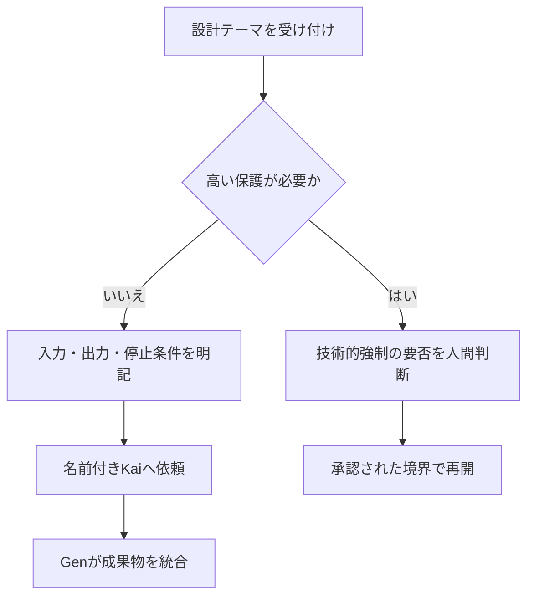

# Kai参加の決定と当面の運用

このサマリーは、Kaiの試運転に対する人間判断と、技術的強制を保留している間の
運用境界を示す。

- 状態: **人間判断済み**
- 判断: **Kaiをチームへ参加させる**
- 技術方式: **保留**

## 結論

名前付きKaiは正常に起動し、責任境界の異なる3つの設計案を作成した。
人間は、この初回成果を条件付きで採用し、Kaiをチームへ参加させる判断をした。

ただし、Kai固有の価値・再現性、read/write非逸脱、技術的強制は未検証である。
参加の判断を、これらが実証済みという意味へ広げない。

## 当面の進め方

Kaiは、既存の安全境界とタスク単位の依頼契約に従って設計成果物を作る。
高い保護が必要な依頼では、Kaiへ割り当てる前に人間へ判断を戻す。

## Kaiへ依頼できること

当面は、次の条件を満たす設計成果物を対象とする。

- `team.md`と`safety.md`に従う設計比較
- 入力allowlistを明記した依頼
- `docs/work/`の指定成果物への書き込み
- 最大出力量、停止条件、再試行上限を明記した依頼
- 技術方式の採否を人間へ戻す比較材料の作成

## 割当前に停止すること

次のいずれかを含む依頼は、Kaiへ割り当てる前に人間へ再判断を戻す。

- コード実装、PoC、設定変更
- 外部サービス接続・送信
- 高権限操作、本番操作
- 読ませてはいけない機密情報やblind試験の非開示入力
- 現在の安全境界やタスク単位契約を越える読み書き

## 保留したこと

次の技術テーマは、必要性が具体化するまで確定しない。

- sandboxまたはpermission profileによる隔離
- read制限を通常タスクにも適用する必要性
- 案Aの専用実行空間
- 案Bのallowlistゲートウェイ
- 案Cの事後監査
- 実現可能性確認、PoC、実装

## 次のメンバー

Tokiの加入は今回の判断に含まれない。Kai参加とToki開始を分け、別の明示承認まで
Tokiを開始しない。

設計3案の詳細は [architecture-options.md](architecture-options.md)、試運転の証跡と
残留リスクは [stage4-kai-trial-retrospective.md](stage4-kai-trial-retrospective.md) に残す。
