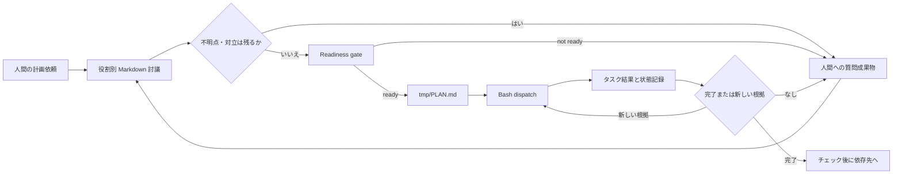

# チーム計画フローの構成案比較

この文書は、計画依頼を実行可能な `tmp/PLAN.md` へ変換するための構成案を
比較する。いずれの案も、最終判断と未解決事項への回答は人間が担い、チーム間の
やり取りは Markdown 成果物に限定する。ここでの「推奨」は統合レビューの候補を
示すものであり、採用を確定するものではない。

## 要件との対応

比較に使う要件 ID を次に置く。各案は全 ID に対応するが、対応の強さと前提は
異なる。

| ID | 要件 |
| --- | --- |
| R1 | 全役割が Markdown 成果物を介して議論する。 |
| R2 | 実行を妨げる不明点は人間へ確認し、解消前に進めない。 |
| R3 | タスクを小さく分割し、独立したものを並行可能にする。 |
| R4 | 実行可能になった時点で `tmp/PLAN.md` を作る。 |
| R5 | 各タスクにゴールと完了条件を記載する。 |
| R6 | 根拠ある再実行だけを許し、進展しない反復は人間へ戻す。 |
| R7 | 依存順に並べ、完了の記録後に依存先へ進む。 |
| R8 | Bash を入口に `codex exec` または `agy -p` を基本として起動する。 |

## 共通の責務境界

どの案でも、討議、実行可能性の判定、実行の状態遷移を別の責務にする。この分離が
ない場合、単に「全員が読んだ」ことを「実行してよい」こととして扱う余地が残る。



この図の gate は設計上の境界であり、単独では技術的な強制を意味しない。技術的な
強制、逸脱検知、事後検証を区別して扱う必要がある。

- 技術的強制は、未完了依存・未チェック遷移・未解消質問を Bash 起動前に止める
  能力である。これは Bash 入口が唯一の実行経路である場合にだけ成立し得る。
- 逸脱検知は、計画外の起動、依存違反、チェックのない遷移を後から識別できる
  能力である。検知は既に起きた逸脱を防ぐこととは異なる。
- 事後検証は、討議、ready 判定、タスク状態、起動結果の関係を人間が追跡できる
  ようにすることである。証跡には計画版、タスク ID、依存関係、状態変更の理由、
  起動の意図と結果の対応が必要になる。

## 案 A: 固定ラウンド成果物と PLAN を直接台帳にする

各役割が固定フォーマットの Markdown をラウンドごとに作成し、統合役が論点台帳を
作る案である。`PLAN.md` は人間が読む計画と Bash が参照する状態台帳を兼ねる。

### 構成

この案では、討議の記録と実行時の状態を、同じ Markdown の定型構文で接続する。

1. 最初のラウンドで、各役割がスコープ、依存、完了の観測、実行上の前提、反対意見を
   役割別成果物に記す。
2. 次のラウンドで、各役割は他役割の成果物を参照し、未解決論点への回答または反証を
   自分の Markdown 成果物に追記する。直接会話は使わない。
3. 統合役は論点を「解消済み」「人間確認待ち」「計画へ反映」に分ける。実行を妨げる
   項目が一つでも残る場合は、質問成果物だけを人間へ提示する。
4. gate を通過した場合だけ、トポロジカル順序の Wave を持つ `PLAN.md` を作る。Bash
   ラッパーは Markdown の定型ブロックを読み、対象タスクと依存タスクの状態を確認して
   から `codex exec` または `agy -p` を起動する想定である。

### `PLAN.md` の概念スキーマ

同一 Wave 内のタスクは依存しない。Wave は依存先が先に完了している順に並び、各
タスクは最初に実行可能になる Wave に置く。Wave 内の表示順は読みやすさのための順序で
あり、並列実行の優先順を意味しない。

```markdown
# Plan: <request title>

- Plan ID: <stable identifier>
- Readiness record: <discussion artifact reference>
- Status: ready | blocked | completed

## Wave 1 — independent foundations

- [ ] T-001 — <goal>
  - Complete when: <observable completion condition>
  - Depends on: none
  - Dispatch: codex | agy
  - Required handoff: <result/evidence description>
  - Reattempt context: <new hypothesis or changed input>

## Wave 2 — depends on Wave 1

- [ ] T-002 — <goal>
  - Complete when: <observable completion condition>
  - Depends on: T-001
  - Dispatch: codex | agy
  - Required handoff: <result/evidence description>
  - Reattempt context: <new hypothesis or changed input>
```

チェックは完了状態の表示であり、依存を満たす根拠そのものではない。台帳が両方を
担うため、Bash が依存とチェックを同じ構文から矛盾なく扱えることが成立条件となる。

### 利点、制約、成立条件

次表は、案 A が成り立つ前提と、比較対象に残す理由を併せて示す。

| 観点 | 内容 |
| --- | --- |
| Pros | R1 の討議履歴と R4–R7 の実行計画を少数の Markdown 成果物で追跡できる。人間が計画を直接読んで修正点を指摘しやすい。 |
| Cons | Markdown を状態機械として構文解析する必要があり、書式の揺れ、手編集、同時編集が Bash の判断を曖昧にする。 |
| 成立条件 | 役割別成果物の保管場所・ラウンド・統合責務が固定され、`PLAN.md` の機械可読部分を全参加者が保つ必要がある。Bash 入口を経由しない実行を防げるか、少なくとも識別できる環境上の前提も必要である。 |
| 成立しない条件 | `tmp/PLAN.md` を正本扱いできない、安全境界の例外が認められない、または任意の Markdown 手編集を Bash が安全に解釈できない場合は、R4/R7/R8 をこの台帳だけで満たせない。 |
| 限界 | `codex exec` と `agy -p` の引数・終了状態・出力の扱いは未確認であり、ラッパーが実行完了を確実に状態へ反映できるとは断定できない。直接コマンド実行が可能なら、ラッパーだけで完全な強制にはならない。 |
| 比較を続ける理由 | 新しい状態形式を増やさず、R1–R6 を一つの人間可読な成果物へ近く配置できるためである。 |

### 再実行と停止

未完了のタスクは、前回と異なる観測、入力、仮説、または人間から得た権限のいずれかを
「Reattempt context」に明示できる場合だけ再起動候補にする。いずれも示せない時点で
タスクは人間確認待ちへ戻す。どこまでを同一状態とみなすか、反復回数をどう限定するかは
別途決める必要がある。

## 案 B: 構造化した計画状態と表示用 PLAN を分ける

この案は、役割別の討議は案 A と同じく Markdown の固定ラウンドで行うが、実行状態を
`PLAN.md` とは別の構造化された計画状態として持つ。`PLAN.md` は人間が読むチェック
ボックス付きの表示成果物とする。

### 構成

この案では、討議の成果と実行状態を分け、`PLAN.md` を状態の表示として位置付ける。

1. 役割別 Markdown と論点台帳で討議し、人間確認待ちが残らないことを readiness
   入力として扱う。
2. 計画状態にはタスク ID、依存、Wave、ゴール、完了条件、状態、再実行根拠を定義する。
   `PLAN.md` はその内容を依存順の Wave とチェックボックスで表示する。
3. Bash 入口は構造化状態だけを参照して起動可否を判断し、起動後の状態も同じ状態へ記録
   する設計とする。`PLAN.md` の表示と状態のずれは逸脱として扱う。

### 利点、制約、成立条件

次表は、案 B の状態分離による利点と、そのために必要な追加責務を示す。

| 観点 | 内容 |
| --- | --- |
| Pros | 依存関係、Wave、完了状態を曖昧な Markdown 解析から分離できる。R7/R8 の技術的強制と、表示の人間可読性を別々に扱える。 |
| Cons | 状態の正本と `PLAN.md` の表示という二重管理になる。生成・同期・同時更新の責務が増え、現行の Markdown 成果物中心の運用から離れる。 |
| 成立条件 | 構造化状態を置く場所と正本性、`PLAN.md` との同期責務、状態更新の所有者を人間が承認する必要がある。`tmp/` 例外の範囲と、Bash がその状態を読める実行環境も前提となる。 |
| 成立しない条件 | 状態ファイルの導入または同期責務を受け入れられない場合、表示だけから安全な起動可否を判断する必要が生じ、この案の分離効果は失われる。 |
| 限界 | 構造化しても、Bash 入口を迂回した実行、外部コマンドの実際の成功、人的な誤った状態更新は自動的には防げない。計画状態の形式や保管場所は未決である。 |
| 比較を続ける理由 | R7/R8 の状態判定を Markdown の表示から切り離せるため、強制を求める場合の責務境界を比較できる。 |

### 再実行と停止

状態に attempt と「前回から変わった根拠」を持たせ、根拠のない同一状態への遷移を
拒否または逸脱として記録する余地がある。人間確認待ちへの遷移が必要となる具体的な
同値判定、上限、復帰権限は未解決事項である。

## 案 C: 人間確認を中心にした助言型 Bash preflight

この案は、固定ラウンドの役割別 Markdown、論点台帳、Wave 付き `PLAN.md` を採用するが、
Bash は起動前に計画の読み合わせを支援するだけに留める。状態遷移の最終確認は人間または
統合役の Markdown 記録で行う。

### 構成

この案では、Bash を計画の確認支援に限定し、最終的な遷移記録を人間中心に保つ。

1. 全役割が二つ以上の Markdown ラウンドで根拠と反対意見を残し、統合役が人間質問を
   分離する。
2. 人間が実行可能性を確認した記録を受けて、依存順の Wave とチェックボックスを持つ
   `PLAN.md` を作る。
3. Bash の preflight は対象タスク、未完了依存、未解決質問、再実行根拠の有無を表示する
   想定に留め、起動を必ず止められるものとは扱わない。完了チェックは結果を見た後に
   Markdown へ記録する。

### 利点、制約、成立条件

次表は、案 C が技術的強制を置かない代わりに保つ運用上の単純さを示す。

| 観点 | 内容 |
| --- | --- |
| Pros | 新しい状態形式や厳格な Markdown パーサーへの依存が小さく、現行の Markdown 中心の受け渡しと人間最終判断を保ちやすい。 |
| Cons | R7/R8 に関する未完了遷移の防止は手順遵守に依存する。preflight を見ずに直接コマンドを実行する逸脱を技術的には防げない。 |
| 成立条件 | 実行責任者が計画とチェックの更新を一貫して行い、人間確認が必要な状態を起動前に確認する運用を受け入れる必要がある。 |
| 成立しない条件 | 「Bash からの起動だけで依存違反を防ぐ」ことが必須なら、この案では満たせない。`tmp/PLAN.md` への書き込み例外が認められない場合も R4 は満たせない。 |
| 限界 | 逸脱は後からの記録照合でしか把握できず、記録されない直接実行の完全な追跡は保証できない。人間確認の待ち時間は並列化の効率を下げ得る。 |
| 比較を続ける理由 | 新しい状態形式や専用の強制機構を導入できない環境での基準線として、実現可能性を比較できる。 |

### 再実行と停止

再実行前に「前回の未達理由」と「今回追加された根拠」を Markdown に残す。新しい根拠が
書けない場合は、Bash を起動せず人間への質問へ戻す運用である。この運用を機械的に守らせる
能力は本案には含まれない。

## 比較

以下は設計上の比較であり、候補を除外する判断ではない。

| 論点 | 案 A: PLAN 直接台帳 | 案 B: 状態と表示を分離 | 案 C: 助言型 preflight |
| --- | --- | --- | --- |
| R1 の討議 | 固定ラウンド成果物 | 固定ラウンド成果物 | 固定ラウンド成果物 |
| R2 の gate | 論点台帳から ready を記録 | 構造化状態へ ready を記録 | 人間確認記録を中心に扱う |
| R3 の Wave | Markdown の依存欄を基に表す | 状態の依存グラフから表す | Markdown の依存欄を基に表す |
| R4/R5 の PLAN | 表示と状態を兼ねる | チェック付き表示として作る | チェック付き計画として作る |
| R6 の再実行 | Markdown の再実行根拠欄 | 構造化状態の遷移根拠 | Markdown の再実行根拠欄 |
| R7/R8 の Bash | 厳格な書式解析に依存 | 状態参照により分離しやすい | 強制ではなく支援に留まる |
| 主な環境依存 | Markdown の安定解析と唯一の入口 | 状態保存・同期・唯一の入口 | 人間による一貫した運用 |
| 保守上の焦点 | スキーマ変更と手編集の整合 | 状態形式と表示同期 | 記録漏れと手順逸脱 |

## 先に人間の判断が必要な事項

次の事項は現時点の入力だけでは確定できず、実行可能な計画を作る前の質問候補となる。

1. `tmp/PLAN.md` を作成・更新するための安全境界上の例外を、どの範囲まで認めるか。
2. `tmp/PLAN.md` を実行状態の正本にするか、人間向け表示に限定するか。
3. Bash 入口を必須経路にできるか。できない場合、許容するのは逸脱検知までか。
4. `codex exec` と `agy -p` が、起動対象の識別、終了状態、結果の関連付けに使える
   ことを確認できるか。
5. 同じ失敗状態の定義、再実行を止める境界、人間へ戻す権限を誰が定めるか。
6. 全役割の参加範囲、討議ラウンド数、統合役が質問を確定する前に必要な反対意見の
   扱いをどう定めるか。

## 統合レビューへの示唆

現行の Markdown 受け渡しと人間最終判断を優先するなら、案 A は最小の新しい概念で
R1–R6 を表現できる候補である。ただし R7/R8 の強制まで求める場合、案 A の Markdown
解析の堅牢性と入口の排他性を先に確認する必要がある。依存遷移の技術的強制を重視する
場合、案 B は責務分離を明確にする候補になるが、状態の正本性と同期の人間判断が前提に
なる。案 C は段階導入または人間確認を最優先する場面で比較対象として残るが、技術的な
防止を要求する用途には限界がある。

いずれを採る場合も、実装判断の前に、ready の定義、`tmp/` 例外、Bash 入口の扱い、
再実行停止の責務を人間が明示する必要がある。検証時には、討議から質問、ready 判定、
Wave、タスク状態、起動結果へ連続して対応付けられる証跡があるかを確認点とする。
